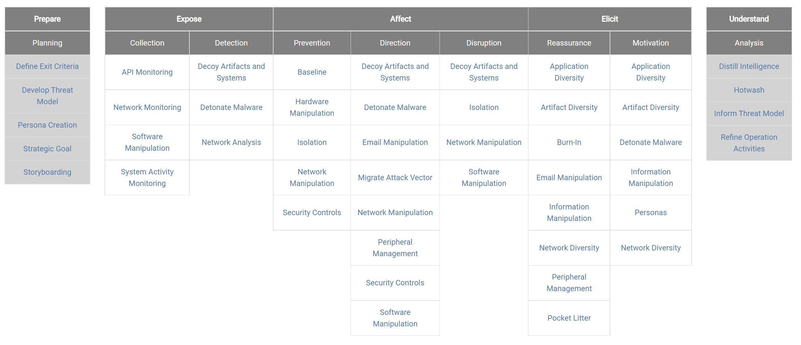
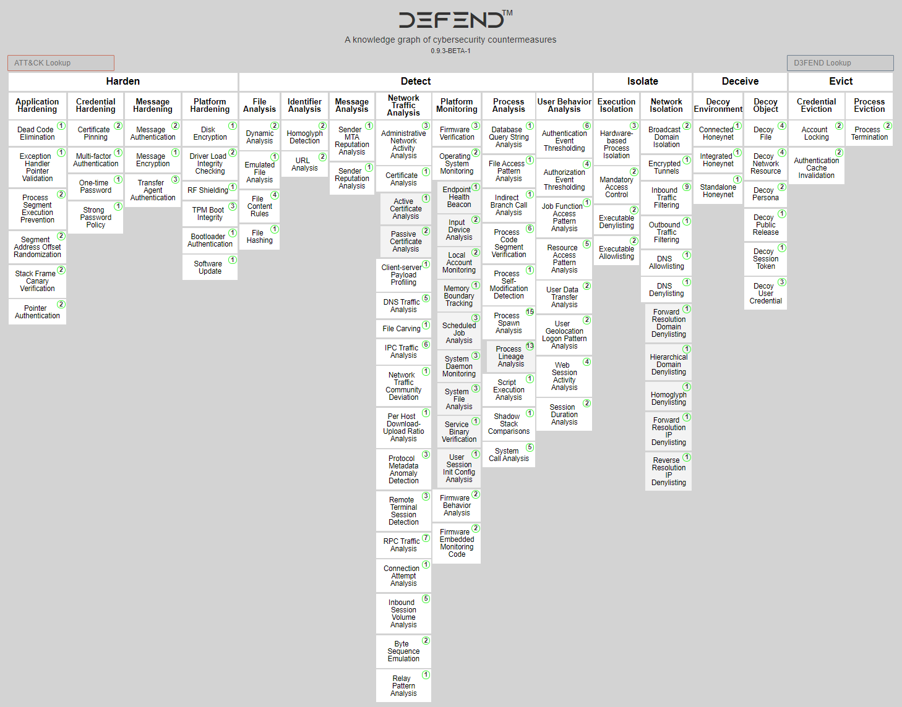

# Attack@defense:An Overview
```
Offensive Security vs Defensive Security
Red Team  Blue Team 

Mitre Att&Ck
Adversary Emulation Plans

Active Defense and MITRE Shield
FROM MITRE Shield to MITRE Engage
MITRE D3fend

NIST CSF
OWASP CDM
```
## [Mitre Att&Ck](https://attack.mitre.org/)
```
MITRE ATT&CK® is a globally-accessible knowledge base of adversary tactics and 
techniques based on real-world observations. 

The ATT&CK knowledge base is used as a foundation for the development of specific threat models and methodologies 
in the private sector, in government, and in the cybersecurity product and service community.

With the creation of ATT&CK, MITRE is fulfilling its mission to solve problems for a safer world 
— by bringing communities together to develop more effective cybersecurity. 

ATT&CK is open and available to any person or organization for use at no charge.
```
- [MITRE ATT&CK® Matrix for Enterprise](https://attack.mitre.org/matrices/enterprise/)
- [講解Windows Matrixr ](https://attack.mitre.org/matrices/enterprise/windows/)
- [ATT&CK Groups犯罪集團](https://shield.mitre.org/attack_groups/)
- [講解Using ATT&CK for Cyber Threat Intelligence Training](https://attack.mitre.org/resources/training/cti/)

- 完成LAB1

- [講解Adversary Emulation Plans]()
  - [08 - BruCON 0x0B - Automated adversary emulation using Caldera - Erik Van Buggenhout](https://www.youtube.com/watch?v=lyWJJRnTbI0) 

## [MITRE Shield](https://shield.mitre.org/) 主動式資安防禦Active Defense

- [MITRE Shield重新定義主動式資安防禦 2021](https://www.ithome.com.tw/article/143481)

```
網路防護能力（General Cyber Defense）
網路欺敵（Cyber Deception）
與攻擊對手的交戰行動（Adversary Engagement）

主動式防禦的戰略分成8個階段: 
引導管道（Channel）、收集（Collect）、牽制（Contain）、偵測（Detect）、破壞（Disrupt）、
促成（Facilitate）、合法化（Legitimize）、測試（Test）

36項技術手法 == >Active Defense Techniques 36類 DTE0036
```
- [Active Defense Tactics 8大戰略](https://shield.mitre.org/tactics/)
- [Active Defense Techniques 36類 DTE0036](https://shield.mitre.org/techniques/)
- [Active Defense Matrix](https://shield.mitre.org/matrix/)

## MITRE Shield(2020年8月) ==>MITRE Engage(2021年待正式版)

- [MITRE Engage](https://engage.mitre.org/)
  - MITRE Engage is a framework for discussing and planning adversary engagement, deception, and denial activities. 
  - Engage is informed by adversary behavior observed in the real world and is intended to drive strategic cyber outcomes. 
  - Engage was created to help the private sector, government, and vendor communities to plan and execute the use of adversary engagement strategies and technologies.

- [MITRE Engage將取代MITRE Shield，聚焦交戰、拒絕與欺敵領域(ithome)](https://www.ithome.com.tw/news/146581)
  - MITRE新版資安知識庫，先前提出的主動式防禦知識庫MITRE Shield，更名為MITRE Engage
  - 正式版本將在秋季發布。
  - 新版內容變得較簡化，而框架採用的術語也有變動
  - 同時提出戰略與交戰行動，並統整5大目標(Engage Goals)、9大方法(Engage Approaches)與31項具體活動(Engage Activities)。
  - 5大目標(Engage Goals)：準備(Prepare)、暴露(Expose)、影響(Affect)、引出(Elicit)與理解(Understand)
  - 9類交戰方法(Engage Approaches)，依序是：準備項目的計畫（Planning），暴露項目的收集（Collection）、偵測（Detection），影響項目的防護（Prevention）、引導（Direction ）與中斷（Disruption），引出項目的再確保（Reassurance）、動機（Motivation），以及理解項目的分析（Analysis）
  - 以戰略行動而言，目前MITRE提出9種具體活動(Engage Activities)
  - 以交戰行動而言，可歸為22種具體活動(Engage Activities)，累計起來共31種

- [MITRE Engage Matrix Structure](https://engage.mitre.org/matrix/)


- [MITRE Engage ATT&CK® Mappings](https://engage.mitre.org/attack_mapping/)

## [MITRE D3FEND](https://d3fend.mitre.org/)  [[專業的ITHOME報導2021.9.7]](https://www.ithome.com.tw/news/146581)
- MITRE2021年6月新提出了[MITRE D3FEND](https://d3fend.mitre.org/)
- 美國國安局（NSA）資助的研究項目，目前是早期發展階段
- 目的是期望透過這個框架，能建立電腦網路防禦技術的術語，並闡明防禦與攻擊之間的關聯。
- D3FEND是網路安全對策技術的知識庫，它是一份知識圖譜，定義了網路安全對策領域中的關鍵概念，以及相互聯繫這些概念所需關係，做出全面的參照與統整。
- 這個知識庫框架總共歸納出5大類別，分別是：強化（Harden）、偵測（Detect）、隔離（Isolate）、欺敵（Deceive）、驅逐（Evict），並有17個防禦技術面向。



- 強化（Harden）類別，包含應用程式、帳密憑證（Credential）、訊息與平臺這4大面向。
- 偵測（Detect）類別，包含了檔案分析、識別碼分析、訊息分析、網路流量分析、處理程序分析與使用者行為分析這7大面向。
- 隔離（Isolate）類別，包含了執行與網路這兩個面向。
- 欺敵（Deceive）類別，包含了環境與物件這兩個面向。
- 驅逐（Evict類別，則有帳密憑證與處理程序的兩個面向。


# [NIST CSF:The Cybersecurity Framework](https://www.nist.gov/cyberframework)

- [NIST網路安全框架當紅 2019](https://www.ithome.com.tw/article/133173)
- [NIST CSF  2021](https://today.ithome.com.tw/tags/nist-csf)


- [NIST SP 800-53 Rev. 5 Security and Privacy Controls for Information Systems and Organizations](https://csrc.nist.gov/publications/detail/sp/800-53/rev-5/final)
## CSF的組成元素:Three Primary Components
```
框架核心（Framework Core）
框架執行的層級（Framework Tiers）
框架組態（Framework Profiles）
```
## 框架核心(Framework Core)的5大面向
```
The five Functions included in the Framework Core are:
1.識別(Identify)
2.防禦措施(Protect)
3.偵測威脅機制(Detect)
4.攻擊因應(Respond)
5.災害復原(Recover)
```
## [【NIST導入關鍵】7步驟打造整體安全防護網](https://www.ithome.com.tw/news/133172)

# [OWASP CDM(Cyber Defense Matrix)](https://owasp.org/www-project-cyber-defense-matrix/)

- [擬定資安策略需從整體角度看待，活用資安框架及Cyber Defense Matrix更是關鍵](https://www.ithome.com.tw/news/140095)
- [DEvcore/你的資安策略夠明確嗎？透過框架優先緩解真實威脅 2020](https://devco.re/blog/2020/10/13/mitigate-real-threats-by-framework-and-standards/)
#
#
#
### `[延伸閱讀|read-around|Further reading|Weiterlesen|Lectures complémentaires]`

### [CIS(Center for Internet Security):CIS Controls v8 2021](https://www.cisecurity.org/controls/v8/)

- [【資安框架】CIS Controls V7針對網路攻擊的防禦，提供一套處理動作的建議 2019](https://www.ithome.com.tw/article/129576)
- The CIS Controls Self-Assessment Tool, or CIS CSAT
- [CIS Controls v8 Internet of Things Companion Guide](https://www.cisecurity.org/white-papers/cis-controls-v8-internet-of-things-companion-guide/)
- [SANS Top 20:20 Critical Security Controls (CSC) for Effective Cyber Defense 2008](https://blog.netwrix.com/2018/02/01/top-20-critical-security-controls-for-effective-cyber-defense/)

### CIS Controls v8 2021
```
CIS Control 1: Inventory and Control of Enterprise Assets
CIS Control 2: Inventory and Control of Software Assets
CIS Control 3: Data Protection
CIS Control 4: Secure Configuration of Enterprise Assets and Software
CIS Control 5: Account Management
CIS Control 6: Access Control Management
CIS Control 7: Continuous Vulnerability Management
CIS Control 8: Audit Log Management
CIS Control 9: Email Web Browser and Protections
CIS Control 10: Malware Defenses
CIS Control 11: Data Recovery
CIS Control 12: Network Infrastructure Management
CIS Control 13: Network Monitoring and Defense
CIS Control 14: Security Awareness and Skills Training
CIS Control 15: Service Provider Management
CIS Control 16: Application Software Security
CIS Control 17: Incident Response Management
CIS Control 18: Penetration Testing https://www.cisecurity.org/controls/cis-controls-list/
```


### 零信任網路Zero Trust Network

- [Zero Trust Network：威脅無所不在，不輕易信任才能確保資安](https://www.ithome.com.tw/news/122071)

- zero trust security model |zero trust architecture(ZTA), zero trust network architecture(ZTNA) | perimeterless security,
- 1994: Stephen Paul Marsh:doctoral thesis on computational security at the University of Stirling.
- Forrester安全與風險首席分析師John Kindervag 推動出來的安全模式
- [A Practical Guide To A Zero Trust Implementation” from Forrester](https://www.forrester.com/report/a-practical-guide-to-a-zero-trust-implementation/RES157736?objectid=RES157736)
- 提供了重新思考網路安全防護的方向，而且是提供模組化、具有成本效益的作法
- 採取網路分隔的方式來保護重要的資產，不再只是仰賴持續的警覺、再予以反應，或是在有瑕疵的系統之上，增添額外的防護。
- 指出了【邊界防護策略】的局限  <== perimeterless security
- 零信任模式區分為下列三個核心概念:
  - 不論地點，需確保所有資源的存取都是安全的
  - 其次，採取最低權限的授與策略，嚴格實施存取控制
  - 第三，檢測與記錄所有的流量。
- 我們必須從原本習慣的「信任並且驗證（trust but verify）」的認知，改為「驗證且永不信任（verify and never trust）」

- [美國NIST Special Publication(SP 800-207),Zero Trust Architecture (2020)](https://csrc.nist.gov/publications/detail/sp/800-207/final)
- [英國NCSC(National Cyber Security Centre) Zero trust architecture design principles 2021](https://github.com/ukncsc/zero-trust-architecture)
  - 1.Know your architecture, including users, devices, services and data
  - 2.Know your user, service and device identities
  - 3.Assess your user behaviour, devices and services health
  - 4.Use policies to authorise requests
  - 5.Authenticate & authorise everywhere
  - 6.Focus your monitoring on users, devices and services
  - 7.Don't trust any network, including your own
  - 8.Choose services designed for zero trust
 
- 2009:Google implemented a zero trust architecture ==>  BeyondCorp

### 漏洞分析 
- [Windows最新MSHTML漏洞CVE-2021-40444](https://www.ithome.com.tw/news/146650)
- [中國駭客APT41](https://www.ithome.com.tw/news/146654)
- [30個高度被濫用的安全漏洞2021](https://www.ithome.com.tw/news/145913)
- [微軟修補藏了17年的Office漏洞 2017](https://www.ithome.com.tw/news/118298)
- [SSL-VPN](https://www.ithome.com.tw/news/146620)


### 特殊主題:工控資安與IEC 62443標準
```
資訊科技(IT) ==>  資訊安全管理系統框架 ISO 27001

工業自動化及控制系統(Industrial Automation and Control System, IACS)
網通安全(CyberSecurity)標準 ==> IEC 62443
```
## IEC 62443
- [IEC 62443：2018 工控系統資安管理標準](https://www.isoleader.com.tw/home/iso-coaching-detail/IEC62443)
- [IT與OT各有不同的資安認證標準，企業仍可建立統一的管理制度來同時對應相關的要求，而非重複進行類似的工作](https://www.ithome.com.tw/news/139440)
- [什麼是 IEC 62443?](https://medium.com/62443%E6%A8%99%E6%BA%96%E8%A7%A3%E8%AE%80/%E4%BB%80%E9%BA%BC%E6%98%AF-iec-62443-252bc969f459)
- [ISA/IEC 62443 Certificates and Requirements](https://www.isa.org/certification/certificate-programs/cybersecurity)


### CISA  /National Cyber Awareness System
```
Cybersecurity and Infrastructure Security Agency (CISA)

Malware Analysis Report (AR20-303B)
MAR-10310246-1.v1 – ZEBROCY Backdoor
Original release date: October 29, 2020
https://us-cert.cisa.gov/ncas/analysis-reports/ar20-303b
```
