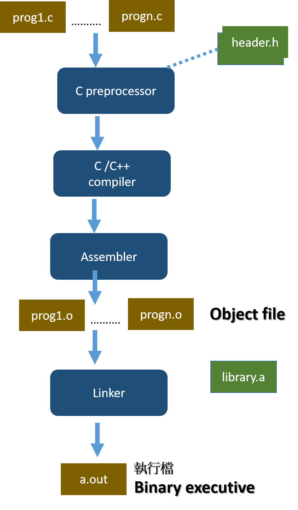

# FromSourceToExecutive

# 1.Linux C 程式的編譯與運行:
## 範例
```
// helloCTFer.c
#include <stdio.h>

int main()
{
   printf("Hello CTFer\n ”);
   return 0;
}
```
## Unumtu 18.04 LTS/Kali Linux

| (1) 編譯 | (2)執行 |(3)檢查執行檔檔案格式|
|-----------------------|-------------|-------------|
| gcc helloCTFer.c   ==>  產生a.out執行檔 |  ./a.out | file ./a.out|
|gcc helloCTFer.c -o helloCTFer |./helloCTFer   | file ./helloCTFer   |
|gcc helloCTFer.c -o helloCTFer.exe | ./helloCTFer.exe | file ./helloCTFer.exe|

- strings ./helloCTFer
- hexdump -C helloCTFer.exe


- [ELF File magic](https://unix.stackexchange.com/questions/153352/what-is-elf-magic)
- hexdump 的用法
```
usage: hexdump [-bcCdovx] [-e fmt] [-f fmt_file] [-n length]
               [-s skip] [file ...]
       hd      [-bcdovx]  [-e fmt] [-f fmt_file] [-n length]
               [-s skip] [file ...]

hexdump還有很多的用法，具體可以參看man hexdump
https://man7.org/linux/man-pages/man1/hexdump.1.html

https://man.linuxde.net/hexdump
https://www.itread01.com/article/1513751613.html
https://www.itread01.com/p/1385440.html
```
# 2_Linux C 程式的編譯與運行:

### 編譯的各階段




| PHASE |command|
|-----------------------|-------------|
|原始程式碼| |helloCTFer.c|
|預處理preprocessing|gcc –E helloCTFer.c –o helloCTFer.i |
|編譯compilation |gcc –S helloCTFer.i  -o helloCTFer.s |
|彙編assembly  |gcc -c helloCTFer.s -o helloCTFer.o |
|連結linking | gcc  helloCTFer.o -o helloCTFer  |

```
gcc helloCTFer.c -o hello -save-temps --verbose

編譯選項:
"-save-temps" ==> 將編譯過程中生成的中間檔案保存下來
"--verbose" ==> 查看GCC 編譯的詳細工作流程，
```


## 3_[AT&T Syntax]  VS  [Intel Syntax]
```
gcc helloCTFer.c -o helloCTFer.s
gcc -S -masm=AT&T  my_XXX.c -o my_XXX.s

gcc -S -masm=intel my_XXX.c -o my_XXX.s 

gcc -S -masm=intel my_XXX.c -o my_XXX.s  -fno-asynchronous-unwind-tables
```

## 4_Reversing using objdump

```
objdump逆向成組語技術  執行檔==> 組合語言


objdump -S -M intel objfile | less

objdump -S -M intel objfile | grep  XXXX

objdump -S -j .text -M intel helloCTFer

objdump -S -j .text -M intel helloCTFer --no-show-raw-insn  
```

## `[延伸閱讀|read-around|Further reading|Weiterlesen|Lectures complémentaires]`

- Advanced C and C++ Compiling by Milan Stevanovic (Apress, 2014).
  - [Github](https://github.com/Apress/adv-c-cpp-compiling)
