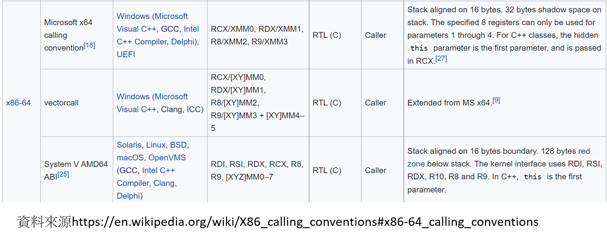

## [calling conventions呼叫約定](https://en.wikipedia.org/wiki/Calling_convention)  [[中文說明]](https://zh.wikipedia.org/wiki/%E8%B0%83%E7%94%A8%E7%BA%A6%E5%AE%9A)

```c
int callee(int, int, int);

int caller(void)
{
   register int ret;
      
   ret = callee(1, 2, 3);
   ret += 5;
   return ret;
}
```

- 呼叫約定是一種定義子過程從呼叫處接受參數以及返回結果的方法的約定。
- 不同呼叫約定的區別在於：
  - 參數和返回值放置的位置 ==> 暫存器(register) vs 呼叫棧(stack) vs 兩者混合
  - 參數傳遞的順序（或者單個參數不同部分的順序）==> 由右到左  vs 由做到右
  - 呼叫前設定和呼叫後清理的工作，在呼叫者(caller)和被呼叫者(callee)之間如何分配


## [x86-calling conventions](https://en.wikipedia.org/wiki/X86_calling_conventions) [[中文說明]](https://zh.wikipedia.org/wiki/X86%E8%B0%83%E7%94%A8%E7%BA%A6%E5%AE%9A)

- cdecl(C declaration)
- fastcall
- syscall:OS2用


## x86-64 calling conventions 


- 第一類型 :System V AMD64 ABI
  - Solaris，GNU/Linux，FreeBSD和其他非微軟OS上使用。
  - 頭六個整型參數放在暫存器RDI, RSI, RDX, RCX, R8和R9上
  - XMM0到XMM7用來放置浮點變元。
  - 同微軟x64約定一樣，其他額外的參數推入棧(stack)
  - 系統呼叫==> 使用R10(替代RCX)
  - 返回值儲存在RAX 
  - 與微軟不同的是，不需要提供影子空間。
  - 在函式入口，返回值與棧上第七個整型參數相鄰。 
- [AMD64 Calling Conventions for Linux / Mac OSX](https://courses.cs.washington.edu/courses/cse378/10au/sections/Section1_recap.pdf)

-第二類型 :[微軟x86-64呼叫約定](https://docs.microsoft.com/en-us/cpp/build/x64-calling-convention?view=msvc-160)
 - 在Windows x64環境下編譯代碼時，只有一種呼叫約定(32位元下的各種約定在64位元下統一成一種)
 - Two important differences between x86 and x64 are the 64-bit addressing capability and a flat set of 16 64-bit registers for general use. 
 - Given the expanded register set, x64 uses the __fastcall calling convention and a RISC-based exception-handling model. 
 - The __fastcall convention uses registers for the first four arguments and the stack frame to pass additional arguments. 

## example 1
```c
# include <stdio.h>

int sum(int a1, int b1,int c1)
{
  return a1+b1+c1;
}


int main()
{
  int a=1,b=2,c=3;
  int summation1;

  summation1 = sum(a,b,c);
  printf("summation1 is %d\n",summation1);

  return 0;

}
```
- gcc test1.c -o test1 -g
- objdump -M intel -D -j .text test1
```
test:     file format elf64-x86-64


Disassembly of section .text:

0000000000001135 <sum>:
    1135:	55                   	push   rbp
    1136:	48 89 e5             	mov    rbp,rsp
    1139:	89 7d fc             	mov    DWORD PTR [rbp-0x4],edi
    113c:	89 75 f8             	mov    DWORD PTR [rbp-0x8],esi
    113f:	89 55 f4             	mov    DWORD PTR [rbp-0xc],edx
    1142:	8b 55 fc             	mov    edx,DWORD PTR [rbp-0x4]
    1145:	8b 45 f8             	mov    eax,DWORD PTR [rbp-0x8]
    1148:	01 c2                	add    edx,eax
    114a:	8b 45 f4             	mov    eax,DWORD PTR [rbp-0xc]
    114d:	01 d0                	add    eax,edx
    114f:	5d                   	pop    rbp
    1150:	c3                   	ret    

0000000000001151 <main>:
    1151:	55                   	push   rbp
    1152:	48 89 e5             	mov    rbp,rsp
    1155:	48 83 ec 10          	sub    rsp,0x10
    1159:	c7 45 fc 01 00 00 00 	mov    DWORD PTR [rbp-0x4],0x1
    1160:	c7 45 f8 02 00 00 00 	mov    DWORD PTR [rbp-0x8],0x2
    1167:	c7 45 f4 03 00 00 00 	mov    DWORD PTR [rbp-0xc],0x3
    116e:	8b 55 f4             	mov    edx,DWORD PTR [rbp-0xc]
    1171:	8b 4d f8             	mov    ecx,DWORD PTR [rbp-0x8]
    1174:	8b 45 fc             	mov    eax,DWORD PTR [rbp-0x4]
    1177:	89 ce                	mov    esi,ecx
    1179:	89 c7                	mov    edi,eax
    117b:	e8 b5 ff ff ff       	call   1135 <sum>
    1180:	89 45 f0             	mov    DWORD PTR [rbp-0x10],eax
    1183:	8b 45 f0             	mov    eax,DWORD PTR [rbp-0x10]
    1186:	89 c6                	mov    esi,eax
    1188:	48 8d 3d 75 0e 00 00 	lea    rdi,[rip+0xe75]        # 2004 <_IO_stdin_used+0x4>
    118f:	b8 00 00 00 00       	mov    eax,0x0
    1194:	e8 97 fe ff ff       	call   1030 <printf@plt>
    1199:	b8 00 00 00 00       	mov    eax,0x0
    119e:	c9                   	leave  
    119f:	c3                   	ret    
```


##  example 2
```c
# include <stdio.h>

int sum(int a1, int b1,int c1,int d1,int e1,int f1,int g1)
{
  return a1+b1+c1+d1+e1+f1+g1;
}


int main()
{
  int a=1,b=2,c=3,d=4,e=5,f=6,g=7;
  int summation;
  
  summation = sum(a,b,c,d,e,f,g);
  printf("summation is %d\n",summation);
  
  return 0;
}
```

- gcc test2.c -o test2 -g
- objdump -M intel -D -j .text test2
```c
0000000000001135 <sum>:
    1135:	55                   	push   rbp
    1136:	48 89 e5             	mov    rbp,rsp
    1139:	89 7d fc             	mov    DWORD PTR [rbp-0x4],edi
    113c:	89 75 f8             	mov    DWORD PTR [rbp-0x8],esi
    113f:	89 55 f4             	mov    DWORD PTR [rbp-0xc],edx
    1142:	89 4d f0             	mov    DWORD PTR [rbp-0x10],ecx
    1145:	44 89 45 ec          	mov    DWORD PTR [rbp-0x14],r8d
    1149:	44 89 4d e8          	mov    DWORD PTR [rbp-0x18],r9d
    114d:	8b 55 fc             	mov    edx,DWORD PTR [rbp-0x4]
    1150:	8b 45 f8             	mov    eax,DWORD PTR [rbp-0x8]
    1153:	01 c2                	add    edx,eax
    1155:	8b 45 f4             	mov    eax,DWORD PTR [rbp-0xc]
    1158:	01 c2                	add    edx,eax
    115a:	8b 45 f0             	mov    eax,DWORD PTR [rbp-0x10]
    115d:	01 c2                	add    edx,eax
    115f:	8b 45 ec             	mov    eax,DWORD PTR [rbp-0x14]
    1162:	01 c2                	add    edx,eax
    1164:	8b 45 e8             	mov    eax,DWORD PTR [rbp-0x18]
    1167:	01 c2                	add    edx,eax
    1169:	8b 45 10             	mov    eax,DWORD PTR [rbp+0x10]
    116c:	01 d0                	add    eax,edx
    116e:	5d                   	pop    rbp
    116f:	c3                   	ret    

0000000000001170 <main>:
    1170:	55                   	push   rbp
    1171:	48 89 e5             	mov    rbp,rsp
    1174:	48 83 ec 20          	sub    rsp,0x20
    1178:	c7 45 fc 01 00 00 00 	mov    DWORD PTR [rbp-0x4],0x1
    117f:	c7 45 f8 02 00 00 00 	mov    DWORD PTR [rbp-0x8],0x2
    1186:	c7 45 f4 03 00 00 00 	mov    DWORD PTR [rbp-0xc],0x3
    118d:	c7 45 f0 04 00 00 00 	mov    DWORD PTR [rbp-0x10],0x4
    1194:	c7 45 ec 05 00 00 00 	mov    DWORD PTR [rbp-0x14],0x5
    119b:	c7 45 e8 06 00 00 00 	mov    DWORD PTR [rbp-0x18],0x6
    11a2:	c7 45 e4 07 00 00 00 	mov    DWORD PTR [rbp-0x1c],0x7
    11a9:	44 8b 4d e8          	mov    r9d,DWORD PTR [rbp-0x18]
    11ad:	44 8b 45 ec          	mov    r8d,DWORD PTR [rbp-0x14]
    11b1:	8b 4d f0             	mov    ecx,DWORD PTR [rbp-0x10]
    11b4:	8b 55 f4             	mov    edx,DWORD PTR [rbp-0xc]
    11b7:	8b 75 f8             	mov    esi,DWORD PTR [rbp-0x8]
    11ba:	8b 45 fc             	mov    eax,DWORD PTR [rbp-0x4]
    11bd:	8b 7d e4             	mov    edi,DWORD PTR [rbp-0x1c]
    11c0:	57                   	push   rdi
    11c1:	89 c7                	mov    edi,eax
    11c3:	e8 6d ff ff ff       	call   1135 <sum>
    11c8:	48 83 c4 08          	add    rsp,0x8
    11cc:	89 45 e0             	mov    DWORD PTR [rbp-0x20],eax
    11cf:	8b 45 e0             	mov    eax,DWORD PTR [rbp-0x20]
    11d2:	89 c6                	mov    esi,eax
    11d4:	48 8d 3d 29 0e 00 00 	lea    rdi,[rip+0xe29]        # 2004 <_IO_stdin_used+0x4>
    11db:	b8 00 00 00 00       	mov    eax,0x0
    11e0:	e8 4b fe ff ff       	call   1030 <printf@plt>
    11e5:	b8 00 00 00 00       	mov    eax,0x0
    11ea:	c9                   	leave  
    11eb:	c3                   	ret    
    11ec:	0f 1f 40 00          	nop    DWORD PTR [rax+0x0]

```
